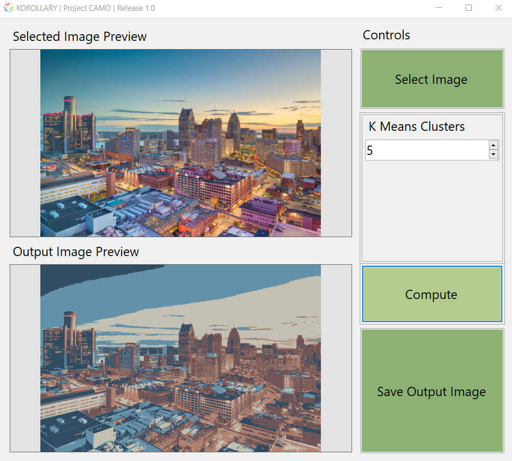

<h1>Korollary</h1>
    
<b>K-Means Clustering on Images</b>

## Index
- [Contributors](#contributors)
- [Korollary](#)
    - [Summary](#summary)
        - [Diagram Overview](#diagram-overview)
        - [C\# Logic](#c-logic)
        - [Haskell Logic](#haskell-logic)
    - [Sample Runs](#sample-runs)
    - [Download Application](#download)

## Contributors:
- Mark Grass
- Anthony Nguyen
- Nuha Aljammas
- Anh Nguyen

## Summary
The application allows users to reduce the color palette of submitted images into a set number of average colors. These average colors are derived by application of the k-means algorithm. A GUI written in C# forms is also included to make submitting images to the haskell program easier, as well as viewing the output images. This allows us to circumvent the command line and improve the overall user experience.

The C# program is only used for preview purposes as well as communication with the Haskell Program. So, the C# program is for the users input image and the number of clusters (colours) in the palette. While the Haskell program will find the average colors in an image (based on clusters), and return it with a reduced color palette.

### Diagram Overview

### C\# Logic
We used the .NET framework to create a C# form to; 
- build the user interface
- extract data from the selected image
- redraw the image

We created a method that takes the images pixels channels (red, green, blue) and sends them to haskel. For the sake of simplicity, the below diagram is a simplified representation of what is happening.

    

Some images (32 bpp) have an alpha channel in each pixel. Therefore if the image contains an alpha channel, we only send the rgb values to the haskell program and exclude the alpha value

Alpha values of 0 means that the pixel is completely transparent, so sending that pixels rgb value to haskell will skew the calculations. The calculations will be skewed because you will be sending rgb values that don’t show up in the original image because it's completely transparent. To handle this case, we don’t send the rgb values with alpha of 0.

Redrawing the modified image is very simple. We take calculated rgb values sent back to us from haskell, then redraw the image with these values while making sure we don’t overwrite the transparent pixels (because we never sent those to haskell).

### Haskell Logic

The Haskell program will take each pixel from the image submitted by the user through the C# program, as well as a “k” value, used to denote how many clusters the Haskell program should look for. First our `getInput` function will read each line until the end of the file. For each line we read we tokenize the R G B values that are separated by spaces. Then we turn those string values into integers through a map function, finally we put the three values (R G B) into a tuple form as to prepare it to be clustered. 

We then run `getInitialCentroids` and `getInitialCentroidsHelper`, those two functions are responsible for the first cluster. It could be thought of as randomized clusters. We divided the size of the input by the **K** the user sent. Now that we have an initial cluster we run our `k-means` function. The `k-means` function is a recursive function that will keep calculating the centers until there is no change in the center value. When that case is reached then k-means will return the centroides. 

Also, the `K-means` function calls `calculateCentroids`. The logic behind calculating Centers is straight forward.  Distance, Centre, div3color, and  sum3color  are the components functions that calculate the distance between two pixels in order to find the closest center to the pixel being sent. 

## Sample Runs

Original Image:

K = 3

K = 10

K = 50

---

Original Image (With transparency):

K = 5

## Download

Go to  and follow the instructions.

Note: Images with higher resolutions may require longer processing
